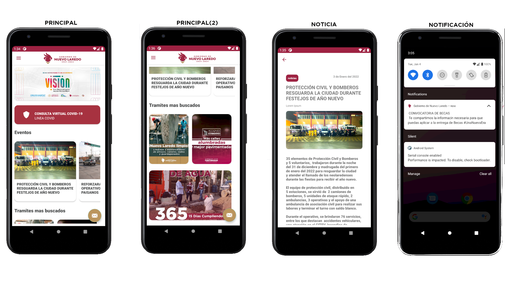

# NVLD APP

Aplicación de la ciudad de Nuevo Laredo (Android).

### Estado del proyecto

**EN DESARROLLO.**

### Abstracto

Este proyecto apunta a crear una aplicación movil con nuevas y mejores caracteristicas que puedan ayudar a la población de Nuevo Laredo.

### Metas y Objetivos

Facilitar procesos.  
Mostrar noticias.  
Notificar avisos, próximos eventos, etc.  

### Casos de uso  
El usuario entra a la aplicación y podra ver las noticias mas recientes, información de interes, etc.  
El usuario cierra aplicacion, un administrador podra enviar notificaciones desde un servidor remoto y el usuario
recibira la notificación.

### No considerado (por el momento)  
Pagos en linea.

### Capturas de pantalla
