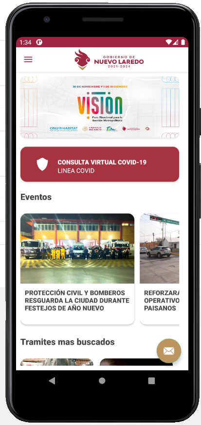
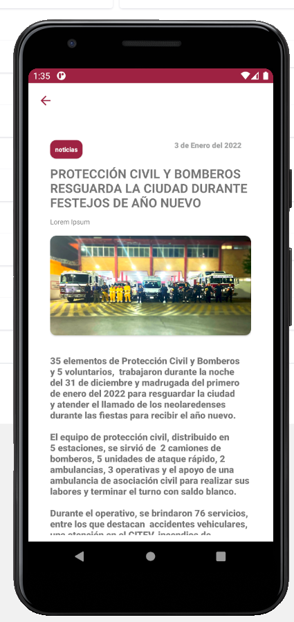
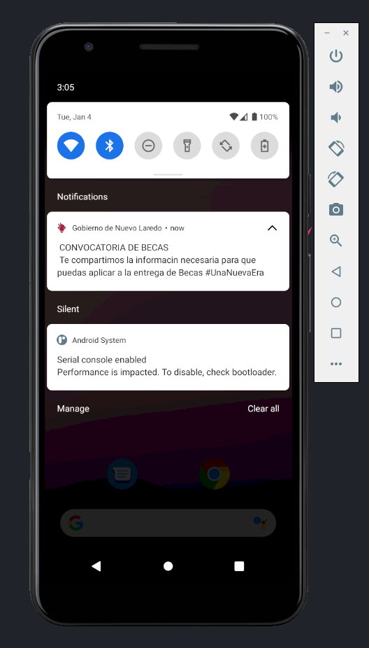

# NVLD APP

Aplicación de la ciudad de Nuevo Laredo (Android)

## Estado del proyecto

En desarrollo

## Abstracto

Este proyecto apunta a crear una aplicación movil con nuevas y mejores caracteristicas que puedan ayudar a la población de Nuevo Laredo.

## Metas y Objetivos

Facilitar procesos  

## Capturas de pantalla

")

